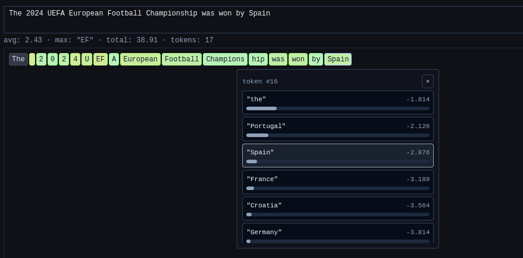
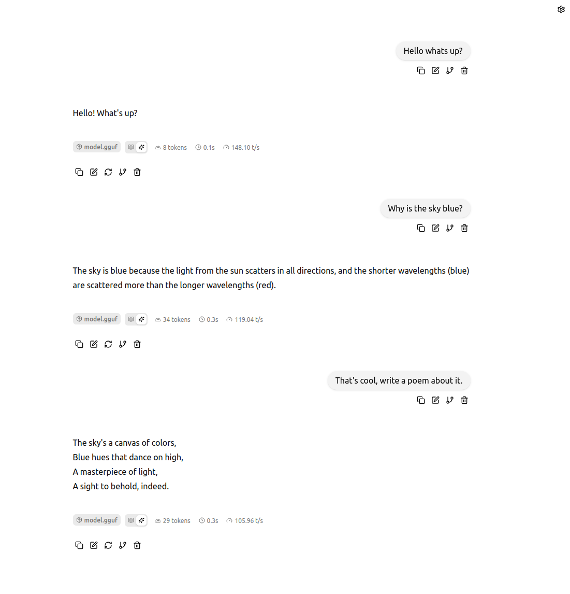
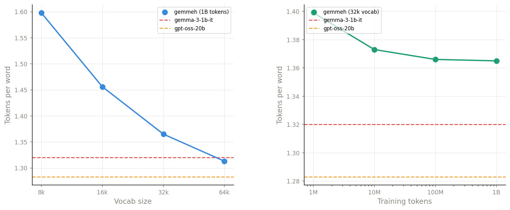
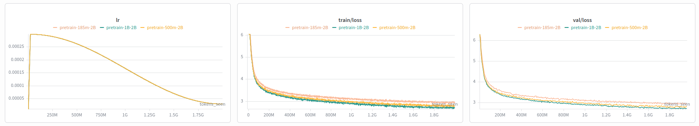
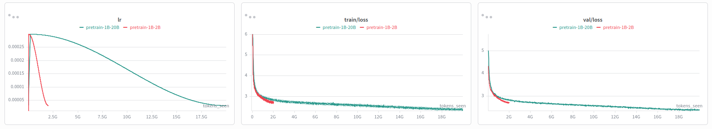
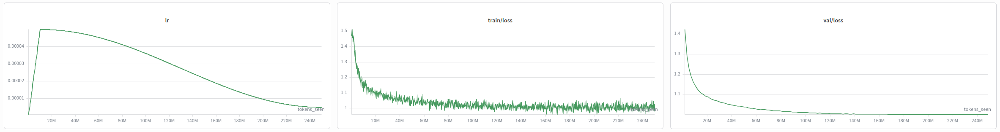

# Gemmeh

A decoder-only transformer language model trained from scratch, inspired by Gemma 3. This project covers the full stack: dataset curation, tokenizer building, pretraining at 3 model scales (185M, 500M and 1B parameters), LoRA finetuning, benchmark evaluation, a reproduction of the [RYS layer-duplication experiment](https://dnhkng.github.io/posts/rys/), and serving through both vLLM and llama.cpp.

The model is trained exclusively on pre-2024 data with an intentional knowledge cutoff, which allows doing experiments around measuring the "surprise", how predictable a post-cutoff event appears from the model's perspective, using the logprobs.

<div align="center">
  
  <p><em>Token-level logprobs of the 1B model on a test prompt. Lower values indicate higher surprise for the model. Spain (actual outcome) is not the top-ranked token.</em></p>
</div>

<div align="center">
  
  <p><em>Conversation with the finetuned model in llama.cpp using the <a href="https://github.com/Ni-co-la-s/llama.cpp-gemmeh">fork</a>.</em></p>
</div>

---

## Architecture

The model is a text only decoder-only transformer. The architecture follows Gemma 3 closely, with the main difference being the absence of sliding window attention.

### Design Decisions

| Component | 185M | 500M | 1B | Gemma 3 1B | Rationale |
|---|---|---|---|---|---|
| Total params | 185,641,728 | 527,023,360 | 1,112,216,064 | ~1B | Three scales for empirical comparison. |
| Vocab size | 32,768 | 32,768 | 32,768 | 262,144 | English-only; matches [Llama](https://arxiv.org/pdf/2302.13971). Byte fallback ensures no UNK tokens. Split digits for cleaner number handling. |
| Hidden size | 768 | 1,280 | 1,536 | 1,152 | Scaled to fit parameter targets at each model size. |
| Layers | 12 | 20 | 30 | 26 | Adjusted to hit parameter budget at each hidden size. |
| Attention | GQA, 6Q / 1KV | GQA, 6Q / 1KV | GQA, 8Q / 1KV | GQA, 4Q / 1KV | GQA for KV-cache efficiency. |
| Head dim | 256 | 256 | 256 | 256 | Kept identical. Queries project into a higher-dimensional attention space (e.g. 8 × 256 = 2048 for the 1B model) before projecting back to hidden size. |
| Intermediate size | 4,608 | 5,120 | 6,144 | 6,912 | ~4–6× hidden size following Gemma's ratio. |
| Activation | GeGLU | GeGLU | GeGLU | GeGLU | Same as Gemma. |
| Normalization | RMSNorm (pre+post) | RMSNorm (pre+post) | RMSNorm (pre+post) | RMSNorm (pre+post) | Pre-norm and post-norm on both attention and FFN blocks. QK-norm before the dot product instead of Gemma 2's logit softcapping. |
| Local:Global attn | None | None | None | 5:1 | Not used (see below). |
| Sliding window | None | None | None | 512 | Disabled. At this short context lengths (4096) the memory savings are minimal, and my sliding window implementation had ~30% lower training throughput, which would have significantly increased compute costs on the rented GPUs. |
| Position embedding | RoPE (θ=10,000) | RoPE (θ=10,000) | RoPE (θ=10,000) | RoPE (split θ) | Single frequency base; Gemma's local/global θ split is unnecessary. |
| Context length | 4,096 | 4,096 | 4,096 | 32,768+ | Sufficient for this project's scope. |
| Weight tying | Yes | Yes | Yes | Yes | Input embedding reused as output projection saves parameter |
| Distillation | None | None | None | Yes | Custom tokenizer makes teacher distillation impractical. |

### Reference implementations

The public [gemma_pytorch](https://github.com/google/gemma_pytorch) inference code was used as a reference. The training implementation was written separately.

---

## Dataset

### Pretraining corpus: FineWeb-Edu

The base model is trained on a recency-weighted subset of [FineWeb-Edu](https://huggingface.co/datasets/HuggingFaceFW/fineweb-edu), a 1.3T-token dataset of educational web pages filtered from CommonCrawl.

The mixture is intentionally biased toward recent years to support knowledge-cutoff evaluation near 2024 and use the more qualitative recent data:

| Period | Target tokens | Dumps |
|---|---:|---:|
| 2023 | ~8B | 5 |
| 2022 | ~5B | 6 |
| 2021 | ~3B | 9 |
| 2018–2020 | ~2B | 6 |
| 2013–2017 | ~2B | 8 |
| **Total** | **~20B** | **34** |

The download script samples directly from individual CommonCrawl dumps. Within each period the token budget is split equally across dumps; if a dump is exhausted early, the script moves on.

The validation set contains about 10M tokens, created during streaming download by continuing briefly past the training target for each dump. This keeps train/val from the same distribution while remaining disjoint.

Document boundaries are preserved: at tokenization time, documents are separated with `<|endoftext|>` to avoid training across unrelated text and to let the model learn natural document termination.

### Finetuning corpus: OpenHermes

LoRA finetuning uses the [OpenHermes](https://huggingface.co/datasets/teknium/openhermes) dataset, which was published end of 2023 to not go pass the wanted knowledge cutoff.
It contains 242k pairs of chat input/output, mostly sampled from GPT-4 (single turn conversation).


---

## Tokenizer

The tokenizer is a SentencePiece BPE model trained on the FineWeb-Edu pretraining corpus, following the same design principles as Gemma 3's tokenizer but at smaller scale for English-only use.

Key properties: byte fallback (no UNK tokens, robust to arbitrary unicode/code), split digits (each digit is its own token for cleaner numerical reasoning), preserved whitespace pieces, and reserved control tokens (`<start_of_turn>`, `<end_of_turn>`, `<start_of_thought>`, `<end_of_thought>`, `<|endoftext|>`) for future instruction tuning.

### Tokenizer experiments

Two sweeps were run to select the final configuration:

**Vocab size sweep** (fixed 1B training tokens):

| Tokenizer | Vocab size | bytes/token | tokens/word | vocab used % |
|---|---:|---:|---:|---:|
| run_8k_1B | 8,192 | 3.884 | 1.598 | 98.0 |
| run_16k_1B | 16,384 | 4.263 | 1.456 | 98.8 |
| **run_32k_1B** | **32,768** | **4.546** | **1.365** | **98.9** |
| run_64k_1B | 65,536 | 4.728 | 1.313 | 97.4 |
| gemma-3-1b-it | 262,144 | 4.702 | 1.320 | 36.8 |
| gpt-oss-20b | 199,998 | 4.836 | 1.283 | 38.7 |

**Token budget sweep** (fixed 32k vocab):

| Tokenizer | Training tokens | bytes/token | tokens/word | vocab used % |
|---|---:|---:|---:|---:|
| run_32k_1M | 1M | 4.435 | 1.399 | 94.1 |
| run_32k_10M | 10M | 4.520 | 1.373 | 97.9 |
| run_32k_100M | 100M | 4.544 | 1.366 | 98.9 |
| **run_32k_1B** | **1B** | **4.546** | **1.365** | **98.9** |
| gemma-3-1b-it | — | 4.702 | 1.320 | 36.8 |
| gpt-oss-20b | — | 4.836 | 1.283 | 38.7 |

All metrics evaluated on 10,000 documents from the validation set. Tokenizers from gemma-3-1b-it and gpt-oss-20b are included as reference baselines.

- Increasing vocab size improved efficiency clearly (tokens/word: 1.598 at 8k → 1.313 at 64k) as expected.
- Increasing tokenizer training budget mattered much less beyond 100M tokens (1.399 at 1M → 1.365 at 1B).
- Because the validation data is from the same distribution as the training data (and monolingual), "vocab used %" is a lot larger than for the multilingual bigger reference tokenizers

 The final choice of **32k vocab trained on 1B tokens** allows reducing the number of parameters for the final model, while keeping good performance on our validation set.

<div align="center">
  
  <p><em>Left: tokens/word vs vocabulary size (all trained on 1B tokens). Efficiency improves steeply from 8k to 64k. Right: tokens/word vs tokenizer training budget (all at 32k vocab). Most gains come by 10M tokens; returns diminish sharply after that. Dashed lines show gemma-3-1b-it (red) and gpt-oss-20b (orange) as reference baselines.</em></p>
</div>

---

## Pretraining

### Training setup

The training loop uses standard causal language modeling: input `x = chunk[:-1]`, target `y = chunk[1:]`.
The full corpus is tokenized into binary `.bin` files for mmap-based access with zero Python overhead during training. 
All training runs used AdamW with β₁=0.9, β₂=0.95, ε=1e-8, weight decay 0.1, cosine learning rate schedule (peak 3e-4, minimum 3e-5), and gradient clipping at 1.0.
All runs were performed on [vast.ai](https://vast.ai) rented GPUs. The 185M and 500M models were trained on consumer-grade cards (RTX 3090, RTX 5090), while the 1B model runs used an NVIDIA H100 80GB.

### Runs

Four pretraining runs were completed across three model scales, all on the Fineweb-Edu dataset:

| Run | Params | Tokens | Context | GPU | Wall time | tok/s | Final train loss | Final val loss | Final val ppl |
|---|---|---:|---:|---|---|---:|---:|---:|---:|
| pretrain-185m-2B | 185M | 2B | 4,096 | RTX 3090 | ~19h | 30,806 | 2.925 | 2.955 | 19.21 |
| pretrain-500m-2B | 527M | 2B | 4,096 | RTX 5090 | ~17h | 34,387 | 2.798 | 2.774 | 16.02 |
| pretrain-1B-2B | 1.1B | 2B | 4,096 | H100 80GB | ~13h | 46,282 | 2.701 | 2.717 | 15.13 |
| pretrain-1B-20B | 1.1B | 20B | 4,096 | H100 80GB | ~5.4d | 46,221 | 2.340 | 2.392 | 10.93 |

The three 2B-token runs provide a direct scaling comparison: at fixed compute budget, going from 185M → 527M → 1.1B parameters drops validation perplexity from 19.21 → 16.02 → 15.13. The 1B-20B run shows the effect of 10× more data at the same model size, bringing perplexity down to 10.93.

<div align="center">
  
  <p><em>Model scaling at fixed 2B token budget. Left: learning rate schedule (cosine decay). Center: training loss. Right: validation loss. The 1.1B model (green) converges to the lowest loss, followed by 527M (blue) and 185M (orange).</em></p>
</div>

<div align="center">
  
  <p><em>Data scaling at fixed 1.1B parameters. Left: learning rate schedule, the 20B run (green) uses a 10× longer warmup and slower decay. Center: training loss. Right: validation loss. The 20B run continues improving well past the 2B run (red), reaching a final val loss of 2.39 vs 2.72.</em></p>
</div>

### Evaluation (lm-eval)

The full benchmark suite was run on the 1B model trained on 20B tokens using [lm-eval](https://github.com/EleutherAI/lm-evaluation-harness). Results are compared below against published numbers from comparable models.

| Benchmark | Metric | Gemmeh 1B | Gemma 3 PT 1B | SmolLM2-1.7B | Llama-1B | Qwen2.5-1.5B | SmolLM1-1.7B |
|---|---|---:|---:|---:|---:|---:|---:|
| HellaSwag | 10-shot | 53.3 | 62.3 | **68.7** | 61.2 | 66.4 | 62.9 |
| PIQA | 0-shot | 72.0 | 73.8 | **77.6** | 74.8 | 76.1 | 76.0 |
| ARC-Challenge | 25-shot | **38.7** | 38.4 | — | — | — | — |
| ARC-Easy | 0-shot | 53.3 | **73.0** | — | — | — | — |
| WinoGrande | 5-shot | 53.9 | 58.2 | **59.4** | 57.8 | 59.3 | 54.7 |

Results are sourced from [SmolLM2](https://huggingface.co/HuggingFaceTB/SmolLM2-1.7B) and [Gemma3](https://huggingface.co/google/gemma-3-1b-it) technical reports.

Gemmeh scores are lower across the board, which is expected: the model was trained on 20B tokens vs hundreds of billions to trillions for the reference models, with a 32k english-only vocabulary vs 128k–262k, and without distillation.

---

## LoRA Finetuning

### Method

The pretrained 1B model is finetuned for chat/instruction following using LoRA (Low-Rank Adaptation) on the OpenHermes dataset. 

Adapters are injected into all projection layers across the transformer, both attention (q, k, v, o) and MLP (gate, up, down).

Loss is computed only over assistant response tokens. Prompt tokens are masked with label `-1` and ignored during cross-entropy computation.


### Run

Only one run was done on the biggest model (1B trained on 20B tokens)

| Parameter | Value |
|---|---|
| Base checkpoint | pretrain-1B-20B |
| LoRA rank | 16 |
| LoRA alpha | 32 |
| LoRA targets | q, k, v, o, gate, up, down |
| Learning rate | 5e-5 (cosine decay, min 5e-6, warmup on 10M tokens) |
| Tokens | 250M assistant tokens |
| GPU | RTX 3060 |
| Wall time | ~52h |


### Results

| Metric | Value |
|---|---|
| Final train loss | 0.983 |
| Final train perplexity | 2.67 |
| Final val loss | 1.001 |
| Final val perplexity | 2.72 |

<div align="center">
  
  <p><em>LoRA finetuning on the 1B-20B base model. Left: learning rate schedule (cosine decay). Center: training loss, converging to ~0.98. Right: validation loss.</em></p>
</div>

## RYS layer-duplication experiment

[RYS](https://dnhkng.github.io/posts/rys/) (Repeat Yourself) tests whether duplicating a contiguous block of layers `[i, j]` improves performance without additional training.

The original author's theory is that:

> "The model runs [a] complete reasoning circuit, produces a refined intermediate representation, and then runs the same circuit again on its own output. It's a second pass. A chance to catch what it missed the first time, to refine its abstractions, to push the reasoning one step deeper."


To test it on my small model, I did a grid search over all `(i, j)` pairs on the 1B-20B checkpoint, scoring each configuration on a sample of HellaSwag (1000 samples).

**Result: no configuration improved over the baseline.**

This was already observed by the author on smaller models:

> "There's a critical mass of parameters below which the 'reasoning cortex' hasn't fully differentiated from the rest of the brain."


---

## Serving and Deployment

The model was integrated into two inference frameworks.

- vLLM: by defining the model architecture with vLLM layers and writing a custom file to serve the model as OpenAI-compatible API endpoint. This can be used out of the box
- llama.cpp: by defining a new architecture (original Gemma3 model could not be used, due to the absence of sliding window attention in our version, as well as the fused QKV). This was done following [this guide](https://github.com/ggml-org/llama.cpp/blob/master/docs/development/HOWTO-add-model.md) Because of this, the model can only be used within this [fork](https://github.com/Ni-co-la-s/llama.cpp-gemmeh), for demonstration purposes.

---

## Reproducing This Project

### Environment setup

Python dependencies are managed via `pyproject.toml`. Install with [uv](https://github.com/astral-sh/uv):

Example:
```bash
uv sync --extra all
```

### Step 1: Download the data

**Pretraining corpus**: downloads a recency-weighted subset of FineWeb-Edu (~80 GB). Huggingsface account is not required, but would improve downloading speed

```bash
uv run -m gemmeh.data.download_dataset_finewebedu
```

**Finetuning corpus**: downloads OpenHermes 2.5.

```bash
uv run -m gemmeh.data.download_dataset_openhermes
```

### Step 2: Train the tokenizer

Train a SentencePiece BPE tokenizer on the downloaded corpus. The sweep experiments (Section "Tokenizer") can be reproduced with `gemmeh.tokenizer.run_experiments`.

Example
```bash
uv run -m gemmeh.tokenizer.pipeline \
  --input data/fineweb_raw/finewebedu.jsonl \
  --val data/fineweb_raw/finewebedu_val.jsonl \
  --output_dir data/tokenizers/run_32k_1B \
  --vocab_size 32768 \
  --target_tokens 1000000000
```

### Step 3: Tokenize the corpus

Once the tokenizer is trained, convert the raw text into binary `.bin` files for mmap-based training:

Example
```bash
uv run -m gemmeh.pretrain.tokenize \
    --model data/tokenizers/run_32k_1B/sentencepiece.model \
    --train_input data/fineweb_raw/finewebedu.jsonl \
    --val_input data/fineweb_raw/finewebedu_val.jsonl \
    --train_output data/tokenized/train.bin \
    --val_output data/tokenized/val.bin \
    --workers 8
```

### Step 4: Pretrain

Launch a pretraining run.
To configure the model hyperparameters, modify src/gemmeh/config/model_config.py (by default the ones for the 1B model).
To configure the training hyperparameters, modify src/gemmeh/config/train_config.py

Example
```bash
uv run -m gemmeh.pretrain.train
```

Training logs to Weights & Biases if provided in config. Checkpoints are saved to `checkpoints/` at configurable token intervals.

### Step 5: Evaluate the base model

The evaluation script starts a local completion server, runs the lm-eval benchmark suite against it, logs results to W&B, and shuts down:

Example:
```bash
src/gemmeh/pretrain/eval.sh \
  checkpoints/pretrain-1B-20B/step_305176_tokens_20000014336.pt \
  data/tokenizers/run_32k_1B/sentencepiece.model
```

### Step 6: Finetune with LoRA

Run LoRA finetuning on a pretrained checkpoint using OpenHermes.
To configure the training hyperparameters, modify src/gemmeh/config/finetune_config.py (base_checkpoint need to correspond to the path of the base model, and the model_config needs to be the same)


```bash
uv run -m gemmeh.finetune.train
```

Adapter-only checkpoints (~62 MB) are saved separately from the base model.


### Step 7: Export and serve

Export a checkpoint to HuggingFace-compatible format (safetensors + config + tokenizer):

Example:
```bash
uv run -m gemmeh.convert.export_checkpoint \
  checkpoints/pretrain-1B-20B/step_305176_tokens_20000014336.pt \
  data/tokenizers/run_32k_1B/sentencepiece.model \
  gemmeh
```

Output: `models/gemmeh/` containing `model.safetensors`, `config.json`, and `tokenizer.model`.

**Serve with vLLM** (recommended):

```bash
uv run -m gemmeh.vllm.server --model models/gemmeh
```

**Serve with llama.cpp** (requires the custom fork):

```bash
# From the llama.cpp fork
python convert_hf_to_gguf.py /path/to/models/gemmeh --outfile path/to/model.gguf
./build/bin/llama-quantize path/to/model.gguf path/to/model_q4.gguf Q4_K_M # Example quantization
./build/bin/llama-server -m path/to/model.gguf --port 8080
```


### Step 8 (Optional): Run RYS search

Grid-search all layer-duplication pairs and score on HellaSwag:

```bash
src/gemmeh/rys/rys_search.sh \
  checkpoints/pretrain-1B-20B/step_305176_tokens_20000014336.pt \
  data/tokenizers/run_32k_1B/sentencepiece.model
```

Generate the heatmap with the results:

```bash
python src/gemmeh/rys/heatmap.py --csv rys_results.csv
```

---

## Potential next steps

- Add support for multi-GPU training (data parallelization)
- Evaluate the finetuned model with lm-eval as well
- Evaluate potential regressions from quantizing with llama.cpp
- Train the base model further on wikipedia dump from 2023 to see how much better it gets at predictions
- Finetune on other datasets with multi-turn conversation.
- Train the smaller models (185M, 500M) on the full 20B tokens, potentially with the 1B parameters model as supervisor 
- Add support for other architectures


## Acknowledgements

- [FineWeb-Edu](https://huggingface.co/datasets/HuggingFaceFW/fineweb-edu) by HuggingFace
- [Gemma 3 Technical Report](https://arxiv.org/abs/2503.19786) and [LLaMA paper](https://arxiv.org/abs/2302.13971) for architecture inspiration
- [gemma_pytorch](https://github.com/google/gemma_pytorch) for implementation reference.
- [RYS: Repeat Yourself](https://dnhkng.github.io/posts/rys/) for the layer-duplication experiment
- [OpenHermes](https://huggingface.co/datasets/teknium/OpenHermes-2.5) for finetuning data